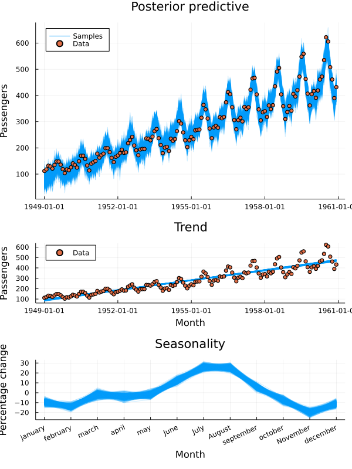

# Prophet-like time series model in Turing
This repo contains a time series model inspired by the [Prophet model](https://peerj.com/preprints/3190/). The implementation is basically a translation of a [Pymc tutorial](https://docs.pymc.io/en/v3/pymc-examples/examples/time_series/Air_passengers-Prophet_with_Bayesian_workflow.html) to [Turing.jl](https://turing.ml/stable/).

## The Model
The model is a standard linear regression model with a multiplicative seasonal component

$$f(t) = (\alpha + \beta t)(1 + s)$$

where $\alpha$ is the intercept,
$\beta$ the trend over time $t$ and $s$ fourier features capturing seasonality.

## Reproducing the results
Download [the data](https://www.kaggle.com/datasets/rakannimer/air-passengers) and unzip the csv into [data](./data).
Then `cd` to the repo, run `julia --project` to start the Julai REPL. Hit `]` to enter the package manager, run `instantiate` to fetch the necessary dependencies and finally `include("main.jl")` to fit the model and produce the plots.

## Model fit

